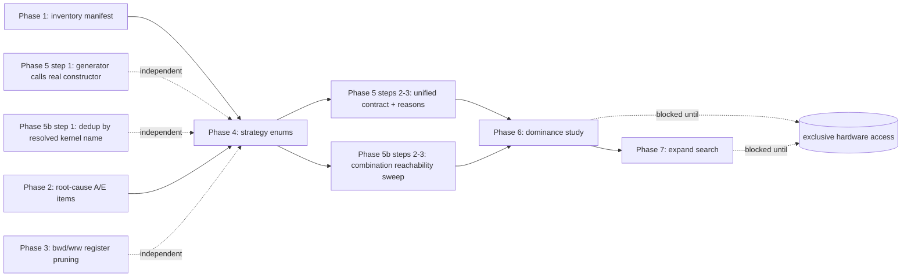

# gfx1250 Tuning Refactor Plan

Source review: `docs/gpt_astra_tuning.md`. This document turns that review's
recommendations into a concrete, phased, independently-executable plan against
this repo's actual current state (inventoried below, September 2026).

**Status of prior work referenced by the review:** three of the review's
own worked examples are already fixed, in this order:

- `48e694f` — TDM LDS-padding descriptor fields + the ignored `current_gks`
  split-K override (both cited in `gpt_astra_tuning.md` as the concrete
  motivating bugs for "fix contract failures" and "reachability must be
  checked").
- `5a7d9c7` — TDM's obsolete VGPR lifetimes eliminated *unconditionally*
  (fwd only) — exactly the "does not need a `remove_unused_tdm_registers`
  knob" prescription in `gpt_astra_tuning.md` §2. Also the TDM/async
  double-buffered schedule reorder.
- `8efd1a8` — added `tdm_multitap` and `wmma_async_store` as new tuning
  choices (correctly gated, mutually exclusive with what they replace,
  default-off/byte-identical) — new surface for Phase 4 to eventually fold
  into the strategy-choice model below, not an argument against it.

None of that work reduced the *number* of tunable fields — this plan is
about the fields themselves: which of the ~30 WMMA-specific optional
tunables are genuine tradeoffs versus accidents of how the feature was
built.

**Scope boundary:** this plan is about the **WMMA/gfx1250 tunable
pipeline only** — consolidating, unifying, and pruning tunables that
already exist, not adding new WMMA capability or porting legacy
MAC/DLOPS/XDLOPS techniques. Where the audit below surfaced a genuine
potential *new* capability (rather than a reorganization of what's already
there), it's recorded in **Parking lot** at the end of this document,
explicitly outside the phases.

## Ground truth: current tunable inventory

Every optional field (`self.X = utility_dict_with_default_t(tunable_dict)(...)`)
in `igemm_gtc_tunable_parameter_t` (`python/igemm/igemm_base.py`, mirrored
in `driver/igemm_gtc_base.h`) was enumerated and classified — the full
class, not just the WMMA-specific `fma_type` branch (see Category F for the
fields that check covers but that turn out to be legacy-only, and the
cross-check performed against the C++ mirror). Categories per
`gpt_astra_tuning.md` §1.

### Category A — Correctness requirements (must be enforced/derived, never a free choice)

| Field | Current state | Gap |
|---|---|---|
| TDM descriptor padding (`lds_row_pad` + `tdm_global_load`) | Fixed (`48e694f`): padding fields derived from `lds_row_pad`, not independently settable | None — already matches the doc's "one selected LDS layout" model |
| fp32 requires `lds_double_buffer=1` | Enforced via assert (`igemm_base.py` COR-001) | Already correctly a hard requirement, not a knob — good |
| `atomic_cascade` | **Deleted (Phase 2).** Field, `atomic_th`, and the dead `th:` branches removed entirely | Resolved — no longer schema cruft |
| Backward rejects `lds_double_buffer && lds_row_pad` | **Root-caused and fixed (Phase 2, R7)** | Resolved — see `docs/gfx1250_bwd_dbuf_ldsrp_nan.md` |
| Forward excludes `saddr_global_load` + `wmma_n_tail` | **Root-caused and fixed (Phase 2)** | Resolved — see `docs/gfx1250_optimization_backlog.md` |
| `wavefront_size`, `cumode`, `tensor_layout` | Forced/single-valued for gfx1250 in practice: every existing config sets `wavefront_size=32` (32-lane wave, per AGENTS.md), `cumode=0`, `tensor_layout='nhwc'`. Consumed by the shared codegen framework (`python/codegen/amdgpu.py`), not per-generator, so they didn't show up in a WMMA-generator-file grep | Not a live tuning dimension today — no config varies them. Belongs in Category A (platform-fixed) rather than Category C; no action needed beyond documenting that they're fixed, not omitted from search |

### Category B — Implementation improvements (should be automatic within their validated domain, flag should shrink then disappear)

| Field | Current state | Gap |
|---|---|---|
| `ds_load_tr_b` | **Already defaults to 1** for bwd/wrw + fp16/bf16 (its full eligible domain) — this is the review's own worked example of "the code already defaults it on" | Still a *settable* flag (can force back to manual transpose). Comment claims "hardware-validated zero regression" already. Best candidate to actually delete once a fresh dominance check (Phase 6) confirms no winning region for manual transpose remains |
| TDM unused-register elimination | Unconditional, no flag (`5a7d9c7`) | Only implemented for **fwd** — bwd/wrw's TDM paths still allocate `v_gld_a/b`-equivalent staging registers unconditionally. Same fix, different files |
| `wrw_incremental_gather` | Still a public flag (default 0) | Doc's "address-generation improvement" pattern — candidate for auto-select once validated as strictly better than the full magic-division re-derivation for its eligible domain (`row_stride==1`, non-TDM) |

### Category C — Workload-dependent tradeoffs (retain as tuning choices)

| Field | Groups with |
|---|---|
| `gemm_m_per_block` / `gemm_n_per_block` / `gemm_k_per_block` (tile shape) | tile choice |
| `async_global_load`, `saddr_global_load`, `tdm_global_load`, `tdm_multitap` | **input transfer strategy** (currently 4 independent booleans, ~11 of 16 combinations invalid) |
| `lds_double_buffer`, `main_loop_interleave`, `local_prefetch_num`, `wmma_gap_hoist`, `wmma_l2_prefetch`, `wmma_setprio` | **pipeline schedule** (currently 6 independent booleans; `wmma_main_loop.py`'s own `can_hoist` derivation already proves these collapse into a handful of real schedules) |
| `direct_store`, `wmma_epilogue_chunked`, `wmma_async_store`, `wmma_fp16_output` | **output strategy** (currently 4 independent booleans) |
| `gemm_k_global_split`, `gsplit_stagger`, `atomic_pack_bf16`, `atomic_scope`, `wrw_reduction_kernel`, `wrw_streamk` | **reduction strategy** (currently 6 independent booleans/enums, wrw-specific ones only meaningful under split-K) |
| `wmma_acc_f16`, `wmma_acc_bf16` | accumulation precision (real numerical tradeoff, correctly kept tunable per the doc) |
| `epilogue_lds_pad`, `lds_row_pad` | LDS layout (bank-conflict tradeoff, genuinely workload-dependent per the doc's own measurement: "padding won in the forward master search, but backward currently rejects padding combined with double buffering") |
| `wmma_acc_high_bank` | resource layout tradeoff |
| `wmma_m_tail`, `wmma_n_tail`, `wmma_k_tail` | **not really tuning choices** — see Category D note below |

### Category D — Runtime applicability, not tuning choices

`wmma_m_tail`/`wmma_n_tail`/`wmma_k_tail` are miscategorized today as
tunable booleans, but per `gpt_astra_tuning.md` §5 they belong under
**runtime applicability** ("dimension tails"), not build-time tuning: a
given compiled kernel either needs tail handling for the requested shape or
it doesn't — there is no scenario where a user should be choosing this the
way they choose a tile size. Today the driver *does* select between
tail/exact-fit kernel variants correctly at dispatch time, but the fact that
they are encoded as ordinary tunable dict fields (searched combinatorially
in `script/generate_all_configs.py`) blurs the category. Phase 5 should
formalize these as derived/required-companion variants of each tile choice,
not independent tuning dimensions.

### Category E — Experimental/incomplete (must stay outside the normal tuning space)

- `atomic_cascade` (confirmed hangs on real hardware, per `igemm_base.py`'s
  own TODO) — already excluded via assert, but per Phase 2 should be
  deleted from the schema entirely rather than kept as a permanently-blocked
  field.
- Any config combination not reachable through `script/generate_all_configs.py`
  or a narrow hand-written config (e.g. `tdm_multitap` + `wmma_k_tail`,
  explicitly asserted-incompatible and untested) — these are correctly
  excluded today via asserts, just need to stay excluded as the strategy
  refactor (Phase 4) proceeds, not accidentally become reachable.

### Category F — Shared-schema fields inherited from legacy generators (out of scope, confirmed dead for WMMA)

Completeness check against the *full* tunable class (not just the WMMA
`fma_type` branch): `igemm_gtc_tunable_parameter_t` also carries fields set
unconditionally for every `fma_type` (MAC/DLOPS/XDLOPS/WMMA alike), outside
the WMMA-specific branch. Verified by grep against every gfx1250 WMMA
generator/operations file (`igemm_{fwd,bwd,wrw}_gtc_wmma_nhwc.py`,
`wmma_main_loop.py`, `coalescing_store_wmma.py`) — none of the following are
referenced there at all; each is read only by the legacy MAC/DLOPS/XDLOPS
`_gtc.py`/`_gtc_nhwc.py`/`_gtc_nchwc.py` generators (and, for `merge_e` and
`vector_store`, their corresponding legacy sections of the C++ drivers,
never the `fma_type == WMMA` branch):

`tensor_a_pass_through`, `tensor_b_pass_through`, `multihead`,
`allow_lds_reorder`, `precache_soffset`, `source_access_order`,
`gemm_m_unmerge_cluster`, `gemm_n_unmerge_cluster`, `gemm_k_unmerge_cluster`,
`vector_store`, `merge_e`, `vector_c`.

These are real, existing tunable fields — not a documentation oversight in
the sense of "forgotten," but they belong to the pre-gfx1250 tuning surface
(gfx908/90a/940/950 MAC/DLOPS/XDLOPS paths) this plan does not touch. They
are listed here explicitly, rather than silently left out, specifically so
a future pass over this plan doesn't need to re-derive "is this one of ours"
from scratch, and so Phase 1's inventory manifest (which should cover the
*whole* tunable class, not just the WMMA branch) marks them
`out_of_scope: legacy-only` rather than leaving them unclassified.

**Cross-check performed:** also diffed every field in the C++
`igemm_gtc_tunable_t` struct (`driver/igemm_gtc_base.h`) against the Python
class — no C++-only tunable field exists without a Python counterpart (the
struct mirror is complete); confirmed the two fields added this session
(`tdm_multitap`, `wmma_async_store`) are present in both the Python class,
the C++ mirror, and this document's Category C table.

**Per-field portability check** — is any of these a technique WMMA hasn't
exploited yet, rather than genuinely dead weight? Two of the twelve are not
dead weight, they're carried-over ideas outside this plan's scope (see
**Parking lot** at the end of this document for why they're not phase
work): `merge_e` and `tensor_a_pass_through`/`tensor_b_pass_through`. The
other ten are confirmed dead, with reasons:

- **`multihead`** — bwd's dilated-convolution dispatch-tiling technique;
  WMMA already handles dilation differently (direct SGPR dilation
  arithmetic in the tap gather, extended by this session's `tdm_multitap`)
  — a different, already-adequate solution to the same problem, not a gap.
- **`source_access_order`** — NCHW memory-order concern; dead given
  gfx1250/WMMA is NHWC-only (Category A: `tensor_layout` is forced).
- **`gemm_m_unmerge_cluster` / `gemm_n_unmerge_cluster` / `gemm_k_unmerge_cluster`**
  — tied to the general N-D tensor-descriptor system MAC/DLOPS use; WMMA's
  addressing is already flatter and doesn't have the problem this solves.
- **`vector_c`** — explicitly NCHWC-only (asserted `vector_c in (4,8,16,32)`
  only when `tensor_layout[0:5]=="nchwc"`); dead given NHWC-only.
- **`vector_store`** — WMMA already has its own equivalent
  (`vector_write_out` in `ctrl_coalescing_store_wmma_t`), under a different
  name — reinvented, not missing.
- **`precache_soffset`** — precomputes global-load scalar offsets once
  instead of re-deriving them per iteration; WMMA's addressing is already
  simple constant-stride adds in every path implemented so far, so likely
  marginal value today. Worth revisiting only if/when a future WMMA path
  gains genuinely complex per-iteration offset math (e.g. a padded
  multi-tap TDM extension).
- **`allow_lds_reorder`** — not just dead for WMMA, dead everywhere:
  defaults to `0` even in its own legacy MAC generators
  (`IGEMM_GTC_FEAT_ALLOW_LDS_REORDER = 0`), and one of its two call sites
  (`igemm_fwd_gtc.py`) hits `assert False, "maybe not correct"` immediately
  after the branch it guards. Never a validated technique anywhere in this
  repo, not specific to WMMA.

### Scale of the duplication problem (Phase 5 evidence)

`script/generate_all_configs.py`'s `is_valid()` (a **third, independent**
copy of legality logic, alongside Python's tunable-constructor asserts and
each direction's C++ `tunable_is_valid`) already hand-encodes ~20 exclusion
rules for only **11** of the ~30 fields above — the comment at line 65-67
of that file already admits this drifts (`ds_load_tr_b` "is NOT added here"
specifically because it was promoted to unconditional, and that promotion
had to be remembered and reflected by hand in this second location). The
two new fields from `8efd1a8` (`tdm_multitap`, `wmma_async_store`) are not
in this generator's `FLAGS` list at all yet — correct for now (they're
deliberately narrow/hand-configured), but exactly the kind of drift Phase 5
is meant to make structurally impossible. Current scale: 317 gfx1250 config
files, ~2000 sections across the 39 master (`_all.config`) files, 65
`return false` legality checks spread across the three C++
`tunable_is_valid` implementations.

## Phases

Each phase lists scope, deliverable, dependency, and whether it needs
exclusive hardware access (this machine is currently shared — phases marked
**[BLOCKED: needs benchmarking]** cannot start until it is free; every other
phase is pure code/design work and can proceed now).

### Phase 1 — Formalize the inventory as a checked artifact

**Scope:** Turn the classification table above into something that can't
silently drift, instead of a one-time markdown snapshot.

- Add a small script (`script/check_tunable_inventory.py` or similar) that
  parses every `utility_dict_with_default_t(tunable_dict)(...)` field in
  `igemm_gtc_tunable_parameter_t.__init__` and cross-checks it against a
  maintained classification manifest (a simple YAML/JSON list: field name →
  category A/B/C/D/E + one-line rationale). Fails loudly if a field exists
  in code but not the manifest, or vice versa.
- This directly targets `gpt_astra_tuning.md` §7's "reachability should be
  mechanically checked" — applied one level up, to the inventory itself:
  a new tunable field landing without a classification decision is exactly
  how the current 30-flag sprawl happened.

**Deliverable:** one script + one manifest file, run manually for now (no
CI in this repo).
**Depends on:** nothing. **Benchmarking:** not needed.

### Phase 2 — Root-cause or delete remaining Category A/E items — **DONE**

**Scope:** For each unresolved item in Category A/E above:

1. `atomic_cascade` — **deleted.** Removed the field (and its TODO block) and the
   `assert not self.atomic_cascade` from `igemm_base.py`, the dead cross-exclusion
   assert from `atomic_pack_bf16`'s block, the `atomic_cascade`/`atomic_th` ctrl
   fields and both `th_str` branches from `coalescing_store_wmma.py`, and the
   `ctrl_coalescing_store_wmma.atomic_cascade = tunable.atomic_cascade` wiring line
   from all three WMMA generators. Repo-wide grep confirmed zero remaining
   references before removal (no C++ mirror ever existed for this field). See
   `docs/gfx1250_misa_investigation_report.md`'s COR-004.
2. Backward's `lds_double_buffer && lds_row_pad` rejection (**R7**) —
   **root-caused and fixed.** `shared_store_b_functor`'s on-the-fly padded B store
   offset (`igemm_bwd_gtc_wmma_nhwc.py`) was recomputed fresh from `v_tid` on every
   call, so unlike `v_sst_os` itself (the physical VGPR the double-buffer XOR
   toggles, and the one the non-padded B path reuses directly) it never picked up
   the runtime buffer selection — B's padded store silently always targeted buffer
   0. Fixed by folding the current buffer-select bit (extracted from `v_sst_os` via
   AND with `lds_single_size`) into B's offset. Hardware-validated `valid:y` on both
   tiles, the original `-nan` repro shape, and a 3x3 shape; the `tunable_is_valid`
   rejection in `driver/igemm_bwd_gtc_driver.h` has been removed. See
   `docs/gfx1250_bwd_dbuf_ldsrp_nan.md`.
3. Forward's `saddr_global_load` + `wmma_n_tail` exclusion —
   **root-caused and fixed.** `igemm_fwd_gtc_wmma_nhwc.py`'s
   `async_global_load`/`saddr_global_load` B-address branch never computed
   `v_flag_b` (the per-lane N-tail mask) at all — only the plain-VADDR path did —
   leaving it garbage on every lane, corrupting the mask even on exact-fit shapes.
   Fixed by computing it in that branch too. Hardware-validated `valid:y` on an
   exact-fit shape and two genuine N-tail shapes; the exclusion in
   `script/generate_all_configs.py`'s `is_valid()` has been removed. See
   `docs/gfx1250_optimization_backlog.md`.
4. Not yet done: folding (2) and (3)'s now-resolved logic into a single legality
   contract remains Phase 5's job (there was no exclusion logic to *move* for (2)/(3)
   any more — the rejections were removed outright, not relocated — but Phase 5
   still applies to every other cross-layer duplication cataloged above).

**Verification:** full fp16 master `_all.config` regression sweep for all three
directions (94 kernel candidates total) across two shapes (1x1 exact-fit, 3x3 with
padding) — zero `valid:n`/`invalid float` results. `test/unittest.py` unaffected
(its one pre-existing failure, `unittest_dotx_coalescing_store`'s
`ctrl_dotx_mapping_t` arity mismatch, reproduces identically on a clean checkout —
unrelated legacy DOTX code, not touched by this phase).
**Depends on:** nothing structurally.
**Benchmarking:** not needed (correctness-only, as scoped).

### Phase 3 — Extend "make derived details internal" to bwd/wrw — **DONE**

**Scope:** `5a7d9c7`'s TDM register pruning only covered fwd. Same audit-and-
prune methodology applied to `igemm_bwd_gtc_wmma_nhwc.py` and
`igemm_wrw_gtc_wmma_nhwc.py`'s TDM paths.

bwd: pruned `v_gld_a` (A's global-load staging buffer) and the whole
A/B-address VGPR set (`v_addr_a`, `v_off_a`/`v_sst_tmp`, `v_addr_b`/
`v_addr_b_base`, `v_off_b`/`v_off_b_base`) plus `v_flag` (A's per-tap OOB
mask) when `tdm_global_load=1` -- VGPR count 256->216 (128x128x32 fp16 TDM
tile). **`v_gld_b` deliberately kept unconditional** (a real, hardware-
confirmed distinction from fwd, found via a build crash this pass): bwd's B
is transposed, and `shared_load_b_functor` reuses `v_gld_b` as scratch for
the manual LDS->VGPR read+pack unpack -- a step TDM's Phase 30 doesn't touch
at all (TDM only replaces the GLOBAL->LDS transfer). Two additional
unconditional-reference sites (bwd's B-base prologue setup;
`shared_load_b_functor`'s `v.v_gld_b` use) needed their own `tdm_global_load`
guards added alongside the register-allocation gating, for the same reason.

wrw: pruned the A/B-address VGPR set (`v_addr_a`/`v_addr_a_base`,
`v_addr_b`, `v_off_a`/`v_off_b`/`v_off_a_base`) and `v_flag` (B's per-
iteration gather flag) -- VGPR count 251->243 (128x128x32 fp16 TDM tile).
`v_gld_a`/`v_gld_b` kept unconditional for the identical reason as bwd's
`v_gld_b` (wrw transposes **both** operands). One unconditional-reference
site (A-base + B-gather-setup prologue block) needed a `tdm_global_load`
guard added.

**Verification:** byte-identical non-TDM `.s` output (both directions,
diffed against a pre-change build). Full regenerated per-tile config sweep
(27 files, 2968 sections) -- zero crashes, 2968/2968 pass real assembly
(`build_and_filter_configs.py`), and a full hardware regression (two shapes
each) -- 5936 kernel-shape runs, zero `valid:n`/`invalid float`, for both
the bwd and wrw pruning passes independently.
**Depends on:** nothing (independent of every other phase).
**Benchmarking:** not needed.

### Phase 4 — Consolidate booleans into strategy choices

This is the largest and highest-risk phase — a real schema migration, not a
local code change. Do it **one strategy group at a time**, each as its own
sub-phase with its own before/after byte-identical regression sweep across
every existing config, not as one monolithic rewrite (matches
`gpt_astra_tuning.md`'s own "I would start with a handful of existing,
validated schedules — not introduce a general scheduling framework").
Suggested order (independent axes first, most-entangled last):

**4a. Input transfer strategy** — replace `async_global_load` /
`saddr_global_load` / `tdm_global_load` / `tdm_multitap` (4 booleans, ~11 of
16 combinations already asserted-invalid) with one
`input_transfer: plain | saddr | async | tdm | tdm_multitap` enum. Lowest
risk: these 4 fields are already mutually exclusive by assert today, so the
enum is a direct rename of an already-exhaustive, already-disjoint case
split — no new legality logic needed, just a schema/config-file/kernel-name
migration. (A `merge_e`-style value is a carried-over idea, not part of
this migration — see **Parking lot** at the end of this document.)

**4b. Output strategy** — replace `direct_store` / `wmma_epilogue_chunked`
/ `wmma_async_store` with one `output_transfer: coalesced_plain |
coalesced_chunked | coalesced_chunked_async | direct` enum (atomic path
stays governed by `gemm_k_global_split` separately, per reduction strategy
below — output transfer and reduction strategy are orthogonal axes, not one
enum). Medium risk: `wmma_fp16_output` is a genuinely separate axis
(output *width*, not output *mechanism*) — keep it a separate field, don't
fold it in just because it also touches the epilogue.

**4c. Reduction strategy** — replace `gemm_k_global_split` /
`gsplit_stagger` / `wrw_reduction_kernel` / `wrw_streamk` with one
`reduction: none | atomic_split_k | atomic_split_k_staggered |
workspace_split_k | stream_k` enum (wrw-only variants simply unavailable
for fwd/bwd). `atomic_pack_bf16`/`atomic_scope` remain separate
(orthogonal: precision-packing and cache-scope hints, not alternate
reduction mechanisms).

**4d. Pipeline schedule** — replace `lds_double_buffer` /
`main_loop_interleave` / `local_prefetch_num` / `wmma_gap_hoist` /
`wmma_l2_prefetch` / `wmma_setprio` with a `schedule:` choice. Highest risk
and do this **last**: `wmma_main_loop.py`'s existing `can_hoist`/`gap_hoist`/
`l2_prefetch` derivation already *proves* most of the legal combinations
collapse to a handful of real schedules — that derivation is the starting
point for the enum's resolver, not a new design. `wmma_setprio` is a pure
issue-priority hint with no interaction with the others; consider whether
it stays an independent orthogonal flag rather than folding into the
schedule enum at all (per the doc: "not every field... deserves to be a
tuning dimension" cuts both ways — don't force an orthogonal flag into a
choice group just for tidiness).

**Migration mechanics (apply per sub-phase, not once at the end):**
Python tunable schema → C++ `igemm_gtc_tunable_t` mirror → config file INI
keys → `igemm_gtc_encode_kernel_name` (both Python and C++) →
`script/generate_all_configs.py`'s `FLAGS`/`is_valid` → every existing
`config/*.config` file (317 files) → `script/build_gfx1250_master_configs.py`.
Per `gpt_astra_tuning.md`: do NOT keep the old boolean fields accepted-but-
ignored during transition — migrate config files in the same change that
removes the old field, so there is never a window where a flag is silently
inert.

**Deliverable per sub-phase:** new enum field, old booleans removed from
schema in the same commit, all existing configs migrated, byte-identical
`.s` regression confirmed for a representative config per old boolean
value, `valid:y` confirmed for at least one config per new enum value.
This is single-axis testing only (one enum's values in isolation) —
cross-axis combinations (e.g. `input_transfer=tdm` with every `schedule`
value) are Phase 5b's job, not repeated here per sub-phase.
**Depends on:** Phase 1 (inventory) done first so nothing is missed; best
done after Phase 2 (fewer exclusion special-cases to carry through the
migration).
**Benchmarking:** not needed for the migration itself (it's a renaming +
legality-preserving refactor) — needed only if a sub-phase's design
questions (e.g. exactly which schedule variants deserve to survive as enum
values) are contested, which Phase 6 should settle first for schedule-
related flags specifically.

### Phase 5 — One authoritative legality contract

**Scope:** Collapse the three copies (Python asserts, C++
`tunable_is_valid`, `script/generate_all_configs.py`'s `is_valid`) into one.
Concrete mechanism, in order of increasing effort:

1. **DONE.** `script/generate_all_configs.py`'s hand-written `is_valid()`
   replaced with an actual construct-emit-assemble attempt: the real
   `igemm_gtc_tunable_parameter_t`, the real direction-specific WMMA
   generator class, full in-memory kernel-body emission, and a real
   `clang++` assembly of the resulting single kernel — catching Category A
   asserts, generator-level asserts, emission-time-only asserts, AND real
   assembler-only failures (found one previously-unknown bug this way: fwd's
   128x64 tile + `wmma_n_tail`, "register index is out of range" on every
   precision — passes every Python assert, only the real assembler catches
   it). Parallelized across all CPUs (`ProcessPoolExecutor`); the full
   55,296-combination sweep runs in ~2.7s. See
   `docs/gfx1250_tunable_exclusions.md` for the resulting catalog.
2. **Structural fix:** define build-time legality (Category A, "can this
   kernel be generated") entirely in the Python tunable constructor (already
   mostly true) and have it also emit the kernel's **runtime applicability
   contract** (Category D: which shapes/alignments/tail combinations this
   specific compiled kernel accepts) as data alongside the `.hsaco` — e.g. a
   small JSON/struct dumped next to each kernel — instead of each direction's
   C++ `tunable_is_valid` hand-re-deriving the same shape math independently
   per direction (currently 65 `return false` sites split unevenly across
   fwd/bwd/wrw with no shared helper).
3. **Explicit rejection reasons:** per `gpt_astra_tuning.md` §5, replace
   silent `return false`/"not applicable" with a reason string (e.g.
   `tunable_is_valid` already returns bool; extend `result_t`/the caller to
   carry *why* — "rejected: TDM requires unit convolution" vs a bare
   skip) at least for `IGEMM_RUN_ONLY_KERNEL`/single-kernel debugging paths,
   without necessarily changing the bulk-sweep output format.

**Deliverable:** step 1 alone (generator calls the real constructor) is a
same-day, low-risk, high-value change independent of everything else in
this plan — do it early, even before Phase 4. Steps 2-3 are larger and
should follow Phase 4's enum consolidation (less legality surface to unify
once 4 boolean groups become 4 enums).
**Depends on:** step 1 depends on nothing; steps 2-3 depend on Phase 4.
**Benchmarking:** not needed.

### Phase 5b — Reachability and deduplication checking (mechanical, no benchmarking)

This is `gpt_astra_tuning.md` §7 in its own right, not a sub-note of Phase
1 or 5 — it needs its own pass because it checks *combinations*, not
individual fields, and it's the direct answer to two questions worth
tracking separately: does every retained tuning dimension actually reach
every alternative in combination with the others, and are we building/
tuning against configs that resolve to an identical kernel more than once?

**Concrete evidence this isn't hypothetical:** `python3
script/build_gfx1250_master_configs.py` (dry run) reports 13 "exact
duplicates skipped" across the current gfx1250 master configs today
(bwd/bf16: 1, bwd/fp32: 2, fwd/bf16: 1, fwd/fp32: 2, wrw/bf16: 2, wrw/fp16:
2, wrw/fp32: 3) — and that number only counts sections whose *raw* `key=value`
text matches exactly (`normalize()`'s key-sorted comparison). It does not,
and cannot, catch two configs with *different* explicit keys that resolve
to the identical effective kernel (e.g. one config explicitly writing
`wmma_setprio=0` and another omitting it entirely — same resolved tunable,
different raw text, invisible to today's dedup). The true duplicate count
is very likely higher than 13.

**Scope:**

1. **DONE.** Deduplicate by resolved kernel name, not raw config text.
   `script/build_gfx1250_master_configs.py` now also computes each
   section's `igemm_gtc_encode_kernel_name` (constructing the real tunable
   object per section) and skips it if that name was already seen — a
   strictly stronger key than `normalize()`'s raw-text comparison, run in
   the same pass rather than replacing it. Zero kernel-name-only duplicates
   found in the current corpus (the raw-text dedup already catches all 13
   known ones) — the mechanism is now in place to catch future drift, which
   was the point.
2. **Cross-axis combination reachability.** Once Phase 4's enums exist,
   enumerate the legal combinations of `input_transfer × schedule ×
   output_transfer × reduction` (filtered through Phase 5's unified legality
   contract) and mechanically confirm, for each: (a) it actually assembles,
   (b) it reports `valid:y` for at least one representative shape. This is
   the direct generalization of this session's own single-combination
   checks (e.g. `tdm_global_load` + `lds_row_pad`, `wmma_epilogue_chunked` +
   `wmma_async_store`) to *every* combination the enum model claims is
   legal — a claim of legality that has never actually been built is exactly
   as untrustworthy as the `current_gks` bug this session already fixed.
   Use the same build-then-drop-failures discipline as
   `script/build_and_filter_configs.py` rather than expecting to hand-verify
   each combination.
3. Extend `script/generate_all_configs.py`'s combinatorial coverage (11
   flags today) to include every Category C dimension post-Phase-4, so
   newly-added tuning choices (this session's `tdm_multitap`,
   `wmma_async_store`; future ones) are combinatorially exercised by
   construction instead of only living in their own bespoke narrow config,
   untested against anything else.

**Deliverable:** a dedup pass integrated into the master-config build
(reject/report kernel-name collisions, not just raw-text ones) and a
combination-reachability report (which enum combinations exist, which
were actually built+run, which are legal-but-never-exercised).
**Depends on:** step 1 can run now, independent of everything else in this
plan (it operates on today's boolean configs just as well as tomorrow's
enums). Steps 2-3 depend on Phase 4 (need the enums to make the combination
space small enough to enumerate rather than 2^30 booleans).
**Benchmarking:** not needed — every check here is build-succeeds/`valid:y`,
the same correctness-only discipline used throughout this engagement, not
a performance comparison.

### Phase 6 — Dominance study — **DONE.** See `docs/gfx1250_dominance_study.md`
for full results (all 4 listed candidates below, plus a fair-chance re-test of
every tuning flag *removed* in the surrounding commits: `wg_swizzle` confirmed no
benefit and stays removed; `atomic_cascade` excluded, hangs hardware, not a perf
question). One correction logged: the first shape sweep almost led to deleting
`wmma_l2_prefetch` before broader coverage reversed that (it has a real winning
region on long-K shapes) — caught before commit; see the doc's "Correction" note.

**Scope:** Apply `gpt_astra_tuning.md` §6's 5-step procedure (validate
domain → compare against best applicable baseline → measure complete
execution cost → repeat enough to separate signal from noise → look for a
surviving winning region for the old choice) to each Category B candidate,
in priority order:

1. `ds_load_tr_b` — best first candidate: already defaults on for its full
   domain, comment already claims zero-regression hardware validation:
   confirm that evidence is real and sufficient (not just "the two known
   failures reproduce identically"), then delete `ds_load_tr_b=0` support
   and the flag entirely if no winning region survives.
2. `wrw_incremental_gather` — same treatment, narrower domain
   (`row_stride==1`, non-TDM).
3. Schedule-related flags flagged in Phase 4d (`wmma_gap_hoist`,
   `wmma_l2_prefetch`, `wmma_setprio`) — the source review already recorded
   a *non-monotonic* result for L2 prefetch ("changed one large-K
   comparison from approximately 60 to 78 µs") — re-measure properly before
   concluding a direction; do not assume the sign of the effect from a
   single old data point.
4. `direct_store` vs coalesced output — review's own measurement says
   direct was worse in a small-K comparison; this is evidence *for* keeping
   both as tunable (Category C), not a dominance candidate — listed here
   only so it isn't mistakenly attempted for removal.

**Deliverable:** per candidate, either (a) delete the flag + old
implementation with a recorded before/after comparison, (b) a documented
automatic-selection rule (e.g. "use hardware transpose whenever
direction∈{bwd,wrw} and precision∈{fp16,bf16}" — already true for
`ds_load_tr_b` today, just needs the escape hatch removed), or (c) keep as
Category C tunable with the measured tradeoff region documented.
**Depends on:** Phase 4 (cleaner to measure against enum choices than
raw booleans) but can start on `ds_load_tr_b` specifically without waiting,
since it's already isolated.
**Benchmarking:** **required** — hardware is no longer shared (per current
session); ready to execute. Prepare the exact shape/config matrix (still a
real prerequisite regardless of hardware access) before starting.

### Phase 7 — Expand tuning search — **[was BLOCKED, now UNBLOCKED pending Phase 6]**

**Scope:** Per `gpt_astra_tuning.md`'s explicit ordering, only *after*
Phase 6 shrinks the space, consider widening `script/generate_all_configs.py`'s
combinatorial coverage (currently 11 of ~30 fields, and missing INT8's
base-section enumeration and output/accumulation-width variants per the
correctness-review doc's item 9). Expanding search space before dominance
work is done would just multiply the number of (possibly-redundant, possibly-
unreachable) configurations that Phase 4-6 then has to account for.

**Deliverable:** updated `FLAGS` list and `is_valid` (by then: "does the
tunable constructor accept this" per Phase 5) covering INT8 and
output-width variants, with each new dimension backed by a Phase 6-style
dominance check showing it isn't redundant.
**Depends on:** Phase 6.
**Benchmarking:** required.

## Parking lot — carried-over ideas, explicitly out of scope for this plan

This plan's phases are scoped strictly to the **existing WMMA tunable
surface**: consolidating, unifying, and pruning the tunables WMMA already
has, not adding new WMMA capability. Two ideas surfaced while auditing
Category F's legacy fields are genuine potential performance techniques for
the WMMA pipeline, but are deliberately **not** phase work here — they are
recorded so they aren't rediscovered from scratch later, not so they get
picked up mid-refactor:

- **`merge_e`-style multi-tap K-folding.** Flatten a multi-tap
  convolution's `Y*X*C` reduction into a single GEMM_K axis processed by
  *one* pass through the K-main-loop, instead of WMMA's current real
  runtime loop over `Y*X` taps (each paying its own per-tap
  descriptor/bookkeeping overhead). Distinct from, and not superseded by,
  this session's `tdm_multitap` (which explicitly excludes the padded case
  this would cover).
- **`tensor_a_pass_through`/`tensor_b_pass_through`-style LDS bypass.** Skip
  the LDS bounce entirely for one operand when its natural memory layout
  already matches the WMMA instruction's required per-lane layout. Whether
  any WMMA operand/precision/tile combination actually satisfies that
  alignment is unresolved — needs a dedicated WMMA-operand-layout analysis
  before it's even known to be viable, let alone a `Category C` tuning
  choice.

Both are new-capability work (closer in kind to the multi-tap-TDM/async-
output-store work from the previous session than to this plan's
consolidate-and-prune phases) and would need their own scoping pass,
design, and hardware validation — the same treatment given to `tdm_multitap`
and `wmma_async_store` earlier. Pick this list up again only after Phases
1-7 land, or sooner if you decide to run it as an independent, parallel
track — but not as part of this plan's phases.

## Suggested execution order given current constraints

Everything below Phase 6/7 can run now, in parallel, without hardware
contention concerns beyond single correctness-only verification runs:

Recommended immediate next action (smallest, highest-value, fully
unblocked): **Phase 5 step 1** — point
`script/generate_all_configs.py` at the real Python tunable constructor
instead of its hand-maintained `is_valid()`. It requires no design
decisions, deletes a proven-drifting duplicate, and de-risks every later
phase that touches config generation. **Phase 5b step 1** (dedup by
resolved kernel name) is comparably cheap and fully independent — worth
doing in the same pass, given 13 known raw-text duplicates already
measured in the current master configs.
